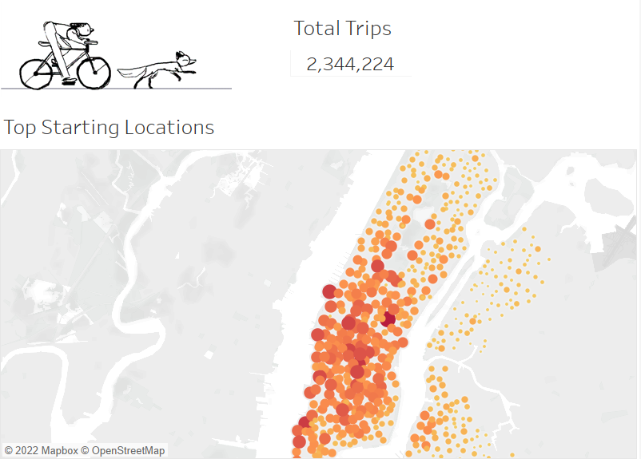
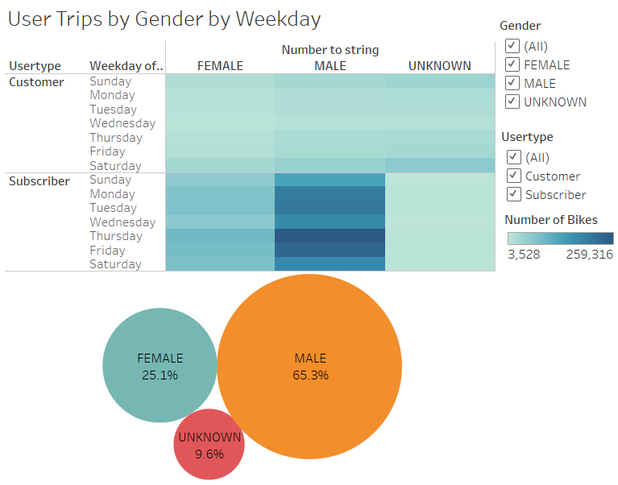

# bikesharing

This project analyzes Citi Bike rideshare - sampling August 2019 data.

## Project Overview

- Deliverable 1: Transformation Data Columns
- Deliverable 2: Create Visualizations for the Trip Analysis
- Deliverable 3: Create a Story and Report for the Final Presentation

 [Link to Tableau dashboard](https://public.tableau.com/views/NYCAugustBikeshareAnalysis/NYCBikeshareStory?:language=en-US&:display_count=n&:origin=viz_share_link)

## Results:

- Manhattan, especially heading toward Lower Manhattan, is a popular ride area

- Majority of the riders and subscribers were male. 65.3% of all riders recorded in this period were male.

- Majority of the riders are subscribers - 81% of all riders were taken by subscribers.

- Weekday rush hour (7-9AM and 5-7PM) saw the highest number of rides. This is likely because riders were taking bikes to and from work. 

- During the weekend, most of the rides recorded saw the highest number when it was light out (9AM - 8PM). It is likely that most weekend riders do it for leisurely city touring or exercise.

- Weekday gender breakdown: Ride numbers saw similar usage between male and female rides. However, male rider numbers were higher.

- Most riders checked out bikes for 5 minutes 

  

Summary:

- There is a high-level summary of the results and two additional visualizations are suggested for future analysis **(5 pt)**